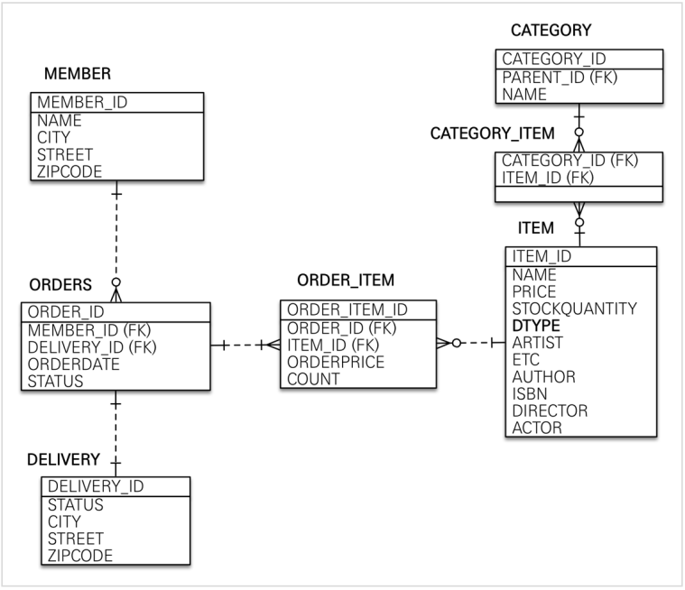

## 연관관계 매핑

### 회원과 주문
일대다, 다대일의 관계.
보통 외래 키가 있는 주문을 연관관계의 주인으로 삼는 것이 좋다고 한다.
외래키는 (반드시) "다" 쪽의 테이블에 존재한다고 한다.  
따라서 여기서 연관관계의 주인은 주문 테이블이고 MEMBER_ID를 외래키와 매핑한다.

### 주문 상품과 주문
주문 상품은 다대다 해소 테이블이다. 다대일 양방향 관계이다.  
마찬가지로 다 쪽의 테이블에 외래키가 존재하고, ORDER_ID를 외래키와 매핑함으로서  
연관관계의 주인을 주문 상품 테이블로 설정한다.  

### 주문 상품과 상품
위와 같은 맥락이다. ITEM_ID를 외래키와 매핑하고 연관관계의 주인을 주문 상품 테이블로 설정한다.

> 연관관계의 주인은 단순히 외래 키를 누가 관리하냐의 문제이지 비즈니스상 우위에 있다고 주인으로 정하면
  안된다.. 예를 들어서 자동차와 바퀴가 있으면, 일대다 관계에서 항상 다쪽에 외래 키가 있으므로 외래 키가
  있는 바퀴를 연관관계의 주인으로 정하면 된다. 물론 자동차를 연관관계의 주인으로 정하는 것이 불가능 한
  것은 아니지만, 자동차를 연관관계의 주인으로 정하면 자동차가 관리하지 않는 바퀴 테이블의 외래 키 값이
  업데이트 되므로 관리와 유지보수가 어렵고, 추가적으로 별도의 업데이트 쿼리가 발생하는 성능 문제도 있
  다.

우리는 자동차가 우위에 있다고 생각하기 쉽지만, 바퀴에 우위가 있다고 보는게 맞다.